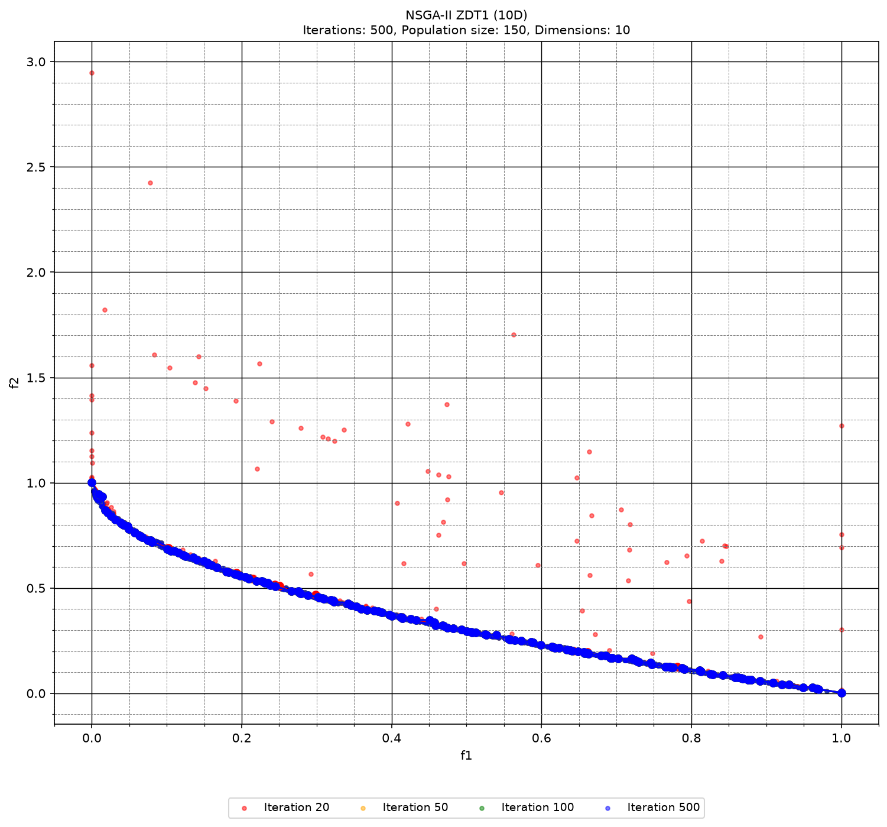
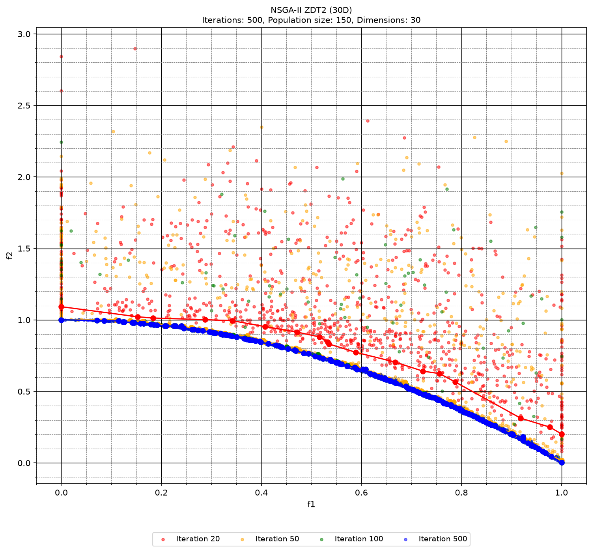
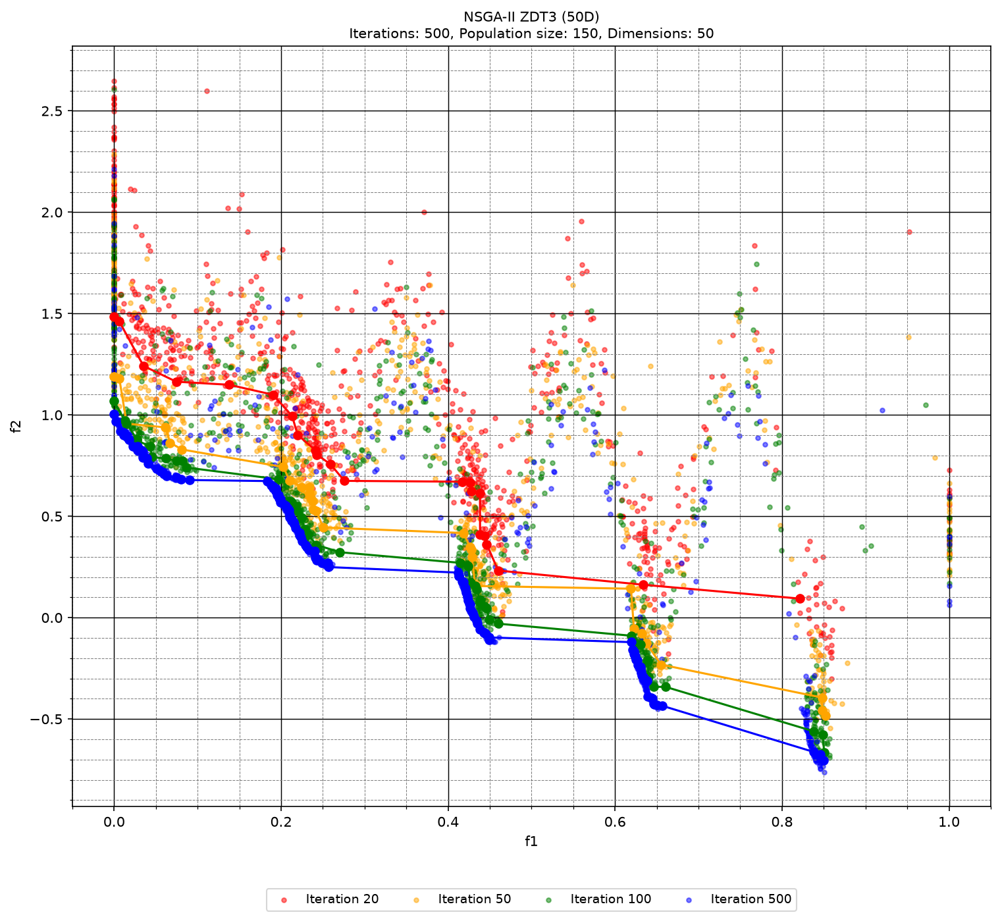
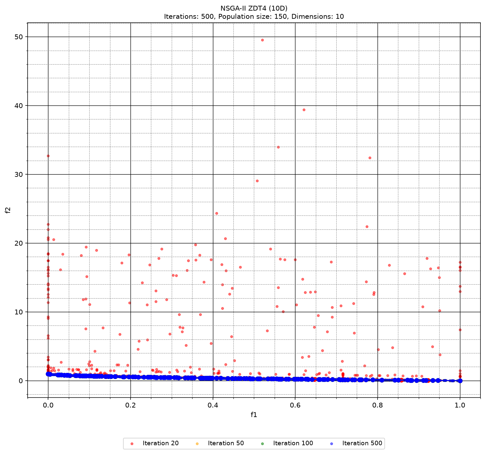

# NSGA-II — optymalizacja wielokryterialna

Implementacja algorytmu **NSGA-II** (*Non-dominated Sorting Genetic Algorithm II*) w C++17 dla wielokryterialnych funkcji testowych ZDT.

Program wykonuje eksperymenty dla funkcji **ZDT1, ZDT2, ZDT3, ZDT4 i ZDT6**. Po zakończeniu obliczeń skrypt Python generuje wykresy przedstawiające populacje oraz fronty Pareto dla kolejnych generacji.

Projekt wykonany w ramach kursu Algorytmy Inspirowane Naturą, UKSW 2024r.  


## Funkcjonalności

- Implementacja sortowania niedominowanego (*fast non-dominated sorting*)
- Obliczanie odległości tłumnej (*crowding distance*)
- Selekcja turniejowa
- Krzyżowanie liniowe
- Mutacja perturbacyjna oparta na rozkładzie Cauchy'ego
- Obsługa funkcji testowych ZDT1, ZDT2, ZDT3, ZDT4 i ZDT6
- Zapis populacji i pierwszego frontu Pareto w wybranych generacjach
- Generowanie wykresów wyników w Pythonie

## Parametry eksperymentów

| Parametr | Wartość |
|---|---:|
| Rozmiar populacji | 150 |
| Liczba generacji | 500 |
| Zapisywane generacje | 20, 50, 100, 500 |
| Wymiary problemu | 10, 30, 50 |
| Funkcje testowe | ZDT1, ZDT2, ZDT3, ZDT4, ZDT6 |
| Liczba celów | 2 |

## Struktura projektu

```text
.
├── CMakeLists.txt       # Konfiguracja budowania CMake
├── main.cpp             # Implementacja NSGA-II i funkcji ZDT
├── RandomGen.h          # Generator liczb pseudolosowych
├── main.py              # Wczytanie danych i generowanie wykresów
├── requirements.txt     # Zależności Pythona
├── docs/
│   └── images/          # Wybrane wykresy do dokumentacji
├── README.md
└── .gitignore
```

## Wymagania

- Kompilator obsługujący **C++17**
- CMake 3.20 lub nowszy
- Python 3
- Biblioteki Python: `matplotlib`, `pandas`

## Instalacja

Sklonuj repozytorium:

```bash
git clone https://github.com/olivblvck/nsga-ii
cd nsga-ii
```

Utwórz lokalne środowisko Python i zainstaluj zależności:

### macOS / Linux

```bash
python3 -m venv .venv
.venv/bin/python3 -m pip install -r requirements.txt
```

### Windows (PowerShell)

```powershell
py -m venv .venv
.\.venv\Scripts\python.exe -m pip install -r requirements.txt
```

## Budowanie i uruchamianie

### CLion

1. Otwórz katalog projektu zawierający `CMakeLists.txt`.
2. Poczekaj, aż CLion załaduje projekt CMake.
3. Wybierz konfigurację `nsga_ii`.
4. Kliknij zielony przycisk **Run**.

### Terminal — macOS / Linux

```bash
cmake -S . -B cmake-build-debug -DCMAKE_BUILD_TYPE=Debug
cmake --build cmake-build-debug
./cmake-build-debug/nsga_ii
```

### Terminal — Windows

```powershell
cmake -S . -B cmake-build-debug
cmake --build cmake-build-debug --config Debug
.\cmake-build-debug\Debug\nsga_ii.exe
```

## Dane wyjściowe

Program zapisuje dane w formacie CSV (z przecinkiem jako separatorem):

```text
population_ZDT{funkcja}_{wymiar}D_{generacja}gen.txt
front_ZDT{funkcja}_{wymiar}D_{generacja}gen.txt
```

Przykłady:

```text
population_ZDT2_30D_100gen.txt
front_ZDT4_10D_500gen.txt
```

Każdy wiersz zawiera wartości dwóch funkcji celu:

```text
f1,f2
```

Skrypt `main.py` odczytuje te pliki i zapisuje wykresy jako:

```text
ZDT{funkcja}_{wymiar}D_plot.png
```

Przykład:

```text
ZDT3_50D_plot.png
```

## Wizualizacja wyników

Na każdym wykresie pokazano populację oraz pierwszy front Pareto dla generacji **20, 50, 100 i 500**:

- czerwony — generacja 20,
- pomarańczowy — generacja 50,
- zielony — generacja 100,
- niebieski — generacja 500.

## Wykresy

Skrypt `main.py` zapisuje wykresy w katalogu `cmake-build-debug/`. Poniżej znajdują się wybrane wyniki.

| ZDT1 — 10D | ZDT2 — 30D |
|---|---|
|  |  |
| **ZDT3 — 50D** | **ZDT4 — 10D** |
|  |  |

## Implementacja

Algorytm reprezentuje pojedyncze rozwiązanie jako zestaw zmiennych decyzyjnych oraz dwóch wartości funkcji celu. Populacja jest dzielona na fronty niedominowane, a osobniki na granicach frontów otrzymują nieskończoną odległość tłumną.

Kolejna populacja powstaje poprzez:

1. sortowanie niedominowane,
2. obliczenie odległości tłumnej,
3. selekcję turniejową,
4. krzyżowanie liniowe,
5. mutację opartą na rozkładzie Cauchy'ego,
6. ewaluację funkcji celu,
7. elitarny wybór populacji następnej generacji.

## Uwagi

Wyniki są losowe, dlatego kolejne uruchomienia mogą generować nieco inne populacje i wykresy.


## Bibliografia

K. Deb, A. Pratap, S. Agarwal, T. Meyarivan,  
*A Fast and Elitist Multiobjective Genetic Algorithm: NSGA-II*,  
IEEE Transactions on Evolutionary Computation, vol. 6, no. 2, 2002.